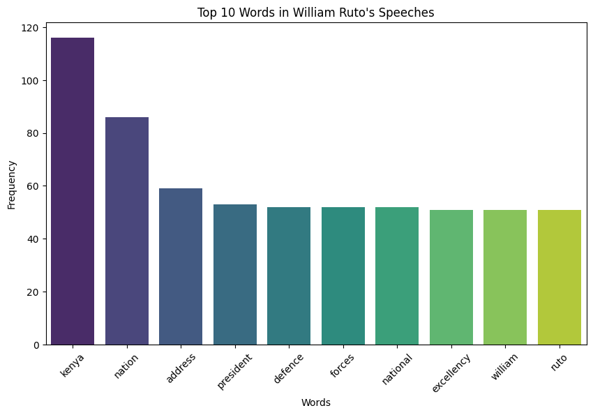
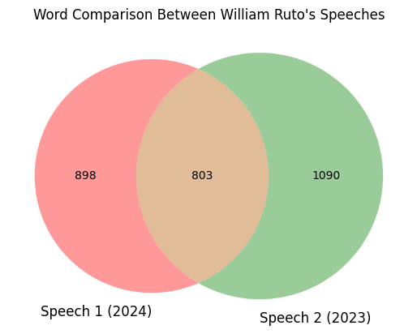
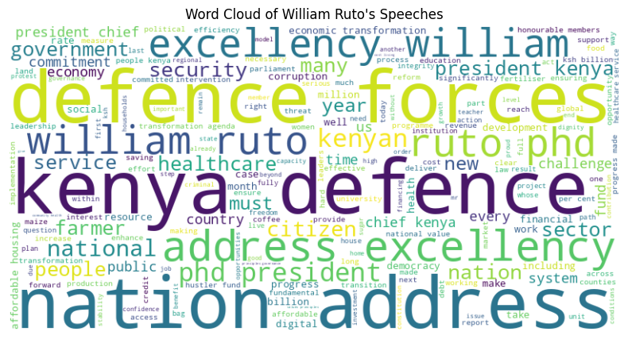

# Analysis of William Ruto’s 2023 and 2024 State of the Nation Speeches

## Introduction
I analyzed two speeches by William Ruto, the President of Kenya, to understand his key messages and priorities. The speeches are from November 9, 2023 (`speech_2.pdf`) and November 21, 2024 (`speech_1.pdf`), both State of the Nation Addresses delivered in Nairobi, Kenya. Using Python tools, I extracted text, counted words, compared the speeches, checked their tone, and identified important names and places. My goal was to see what Ruto focuses on and if his message changed between 2023 and 2024.

## Methods
I used the following tools in a Jupyter Notebook:
- `pdfplumber`: To extract text from the PDFs.
- `nltk`: To split the text into words (tokenization) and count them.
- `spacy`: To simplify words (lemmatization) and find names/places.
- `textblob`: To check if the speeches are positive or negative (sentiment).
- `seaborn`, `matplotlib`, `matplotlib_venn`, `wordcloud`: For visualizations like bar plots, Venn diagrams, and word clouds.

I cleaned the text by removing small words (like "the") and simplified words (e.g., "forces" and "force" become "force").

## Findings

### 1. Extraction and Tokenization
I successfully extracted text from both speeches. After tokenizing (splitting into words) and cleaning, here are the first 10 words from each:  
- **Speech 1 (2024)**: `['republic', 'kenya', 'state', 'nation', 'address', 'excellency', 'william', 'ruto', 'phd', 'president']`  
- **Speech 2 (2023)**: `['republic', 'kenya', 'state', 'nation', 'address', 'excellency', 'william', 'ruto', 'phd', 'president']`  
Both start similarly, showing they follow a formal structure.

### 2. Top Words (Frequency Analysis)
After combining both speeches, the top 10 most common words were:  
- `kenya: 116`  
- `nation: 86`  
- `address: 59`  
- `president: 53`  
- `defence: 52`  
- `forces: 52`  
- `national: 52`  
- `excellency: 51`  
- `william: 51`  
- `ruto: 51`  

**Observation**: "kenya" is the top word by far, showing Ruto focuses heavily on the country. Words like "defence" and "forces" suggest a focus on security, while "nation" and "national" point to themes of unity.

I visualized this in a bar plot:

### 3. Comparison (Venn Diagram)
I compared unique and shared words between the speeches:  
- **Unique to Speech 1 (2024)**: `['play', 'wildest', 'ethical', 'chartered', 'harrison']`  
- **Unique to Speech 2 (2023)**: `['seek', 'steadily', 'ksh129', 'witnesses', 'burden']`  
- **Shared Words**: `['struggling', 'announce', 'confront', 'ict', 'providing']`  

The Venn diagram shows:  
- Speech 1: 898 unique words.  
- Speech 2: 1090 unique words.  
- Shared: 803 words.  

**Observation**: The speeches share many words (803), showing consistency, but Speech 2 has more unique words, possibly indicating more diverse topics in 2023. Words like "ethical" in 2024 might suggest a focus on governance, while "burden" in 2023 could reflect challenges.

### 4. Sentiment Analysis
I checked the tone of each speech:  
- **Speech 1 (2024)**: Polarity=0.09, Subjectivity=0.41  
- **Speech 2 (2023)**: Polarity=0.15, Subjectivity=0.42  

**Observation**: Both speeches are slightly positive (polarity > 0), with 2023 being a bit more positive (0.15 vs. 0.09). Subjectivity around 0.41-0.42 means they mix facts and opinions evenly. Ruto seems optimistic overall, possibly more so in 2023.

### 5. Named Entities
I identified names, places, and organizations:  
- **Speech 1 (2024)**:  
  - **Places**: "kenya" (many times), "us", "eastern coast", "saudi arabia".  
  - **People**: "william ruto", "david maraga", "albert munyi".  
  - **Organizations**: "nato", "hustler fund", "african union".  
  - **Dates**: "november 2022", "next year", "yesterday".  
- **Speech 2 (2023)**:  
  - **Places**: "kenya", "europe", "saudi arabia", "germany", "qatar".  
  - **People**: "william ruto".  
  - **Organizations**: "taifa care", "nhif", "ketraco".  
  - **Dates**: "october 2024", "july 2023", "next week".  

**Observation**: Ruto mentions "kenya" a lot in both years, showing his focus on the country. In 2024, he talks about security ("nato", "defence forces") and specific people ("david maraga"). In 2023, he mentions healthcare ("taifa care") and international partnerships ("saudi arabia", "germany").

### 6. Word Cloud
The word cloud shows "kenya", "defence", "forces", "nation", and "address" as the biggest words, confirming they’re Ruto’s main focus across both speeches.

## Conclusion
William Ruto’s 2023 and 2024 State of the Nation speeches focus heavily on Kenya—its nationhood, security ("defence", "forces"), and leadership ("president", "ruto"). He uses formal language ("address", "excellency") and mentions Kenya 116 times, showing his priority is the country and its people. The speeches are consistent (803 shared words), but 2024 highlights ethics and security ("ethical", "nato"), while 2023 focuses on challenges and healthcare ("burden", "taifa care"). Both speeches are slightly positive, with 2023 being a bit more optimistic (polarity 0.15 vs. 0.09). Overall, Ruto’s message is about strengthening Kenya through security, unity, and progress, with slight shifts in focus each year.

I was surprised by how often "defence" and "forces" appeared, as I expected more economic terms. This project showed me how a leader’s words reveal their priorities over time.